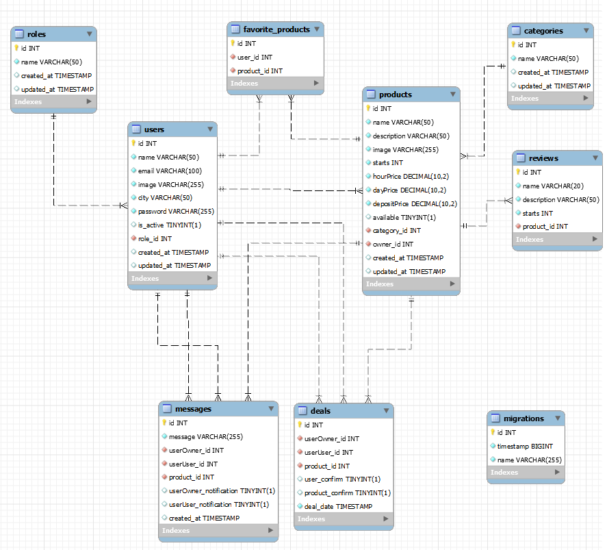

# :wrench:TOOL-RENT API :wrench:

---

<div align="center">


 </div>
 
This is the backend of the final project of the Fullstack Developer Bootcamp, which showcases real-world backend development skills with TypeScript and Express.
The project consists of a tool rental app. Where users can search and upload tools to rent. The app has a chat where users can talk and discuss details with the owner of the product.

---

## Table of Contents :file_folder:

- [Stack 🔧](#stack-wrench)
- [Features 🌟](#features-star2)
- [Local Deployment 🏠](#local-deplyment-house)
- [Live Deployment 📡](#live-deployment-satellite)
- [API Documentation 📑](#api-documentation-bookmark_tabs)
  - [Database Design 📰](#database-design-newspaper)
  - [Relationships ♻️](#relationships-recycle)
  - [Indices and Constraints ➡️](#indices-and-constraints-arrow_right)
  - [Endpoints 🔌](#endpoints-electric_plug)
- [Author ✒️](#author-black_nib)
- [Next versions 🔜](#next-versions-soon)
- [Acknowledgements 🎓](#acknowledgements-mortar_board)

---

## Stack :wrench:

<div align="center">


 </div>

---

## Features :star2:

- **Online chat:** Concrete details between users.💬
- **Real notification system:** User receives notifications when he has a new comment.🔴
- **Add favorite products:** List of favorite products. ❤️
- **No registered functions:** It is not necessary to be logged-in to explore certain parts of the app.👀
- **Endpoints test:** Thunder collection file.👌
- **User Authentication:** Secure signup and login processes. 🔒
- **Admin and SuperAdmin CRUD Endpoints:** Full control over users, products and messages for administrators. 👩‍💼👨‍💼
- **Acurate Documentation:** Fully documented API endpoints. 📚
- **Docker Container:** Easy setup and deployment with Docker. 🐳
- **MySQL Database with TypeORM and Migrations:** Robust database management. 🗄️
- **JWT Authentication:** Secure API endpoints with JSON Web Tokens. 🔑
- **Error Handling:** Custom error middleware for handling common API errors. 📝

---

## Local Deplyment :house:

#### ⚠️You'll need add a `.env` file based on the provided `.env.local.example` file with the database credentials⚠️

- #### GitHub 🐾

  - Get a copy of the project up and running on your local machine:

    ```sh
    git clone https://github.com/Ferelbue/FSD-FINAL-PROJECT-BACKEND.git
    ```

- #### Docker 🐳

  - You'll need Docker installed on your machine and execute:
    ```sh
    $ docker run --name nombre-contenedor -p 3307:3306 -e MYSQL_ROOT_PASSWORD=1234 -d mysql
    ```

- #### MySQL Workbench 🔧

  - Create and run a new server conection with the port, user and passwors establised.

- #### Node 📟

  - Run directly with Node:
    ```sh
    npm install             # Install dependecies
    npm run migration-run   # Run migrations
    npm run seed            # Poblate DB with mock
    npm run dev             # Run server
    ```

- #### Thunder Client :zap:
  - [Open this file in Thunder client extension and test de API ](./HTTP/thunder-collection_FINAL_PROJECT_LOCAL.json)

---

## Live Deployment :satellite:

#### ⚠️You'll need add a `.env` file based on the provided `.env.online.example` file with the database credentials⚠️

- #### GitHub 🐾

  - Get a copy of the project up and running on your local machine:

    ```sh
    git clone https://github.com/Ferelbue/FSD-FINAL-PROJECT-BACKEND.git
    ```

- #### RailWay :curly_loop:

  - Open the following link at an internet browser:
    ```sh
    https://fsd-final-project-backend-production.up.railway.app/api/products
    ```

- #### MySQL Workbench 🔧

  - Create and run a new server conection with the port, user and passwors establised.

- #### Node 📟

  - Run directly with Node:
    ```sh
    npm install             # Install dependecies
    npm run migration-run   # Run migrations
    npm run seed            # Poblate DB with mock
    npm run dev             # Run server
    ```

- #### Thunder Client :zap:
  - [Open this file in Thunder client extension and test de API ](./HTTP/thunder-collection_FINAL_PROJECT_ONLINE.json)

---

## API Documentation :bookmark_tabs:

- ### Database Design :newspaper:



---

- ### Relationships :recycle:

  - `Role` to `Users`: One-to-many relationship where:

    - One role can have many users.

  - `User` to `Messages`: One-to-many relationship where:

    - One user as User can have many messages.
    - One user as Owner can have many messages.

  - `User` to `Deals`: One-to-many relationship where:

    - One user as User can have many deals.
    - One user as Owner can have many deals.

  - `User` to `Favorite Products`: One-to-many relationship where:

    - One user as User can have many favorite products.

  - `User` to `Products`: One-to-many relationship where:

    - One user as Owner can have many products to rent.

  - `Products` to `Messages`: One-to-many relationship where:

    - One product can have many messages.

  - `Products` to `Deals`: One-to-many relationship where:

    - One product can have many deals.

  - `Products` to `Favorite Products`: One-to-many relationship where:

    - One product can be in many user favorite products list.

  - `Products` to `Reviews`: One-to-many relationship where:

    - One category can have many reviews.

  - `Categories` to `Products`: One-to-many relationship where:
    - One category can have many products.

---

- ### Indices and Constraints :arrow_right:

  - `Users` table:
    - Unique constraint on `email` to ensure each user has an unique email address.
    - Foreign key constraint on `role_id` referring to `id` in the `Roles` table.
  - `Products` table:
    - Foreign key constraint on `category_id` and `owner_id` referring to `id` in the `Products` and `Messages` tables.
  - `Messages` table:
    - Foreign key constraint on `userOwner_id`, `userUser_id` and `product_id` referring to `id` in the `Users` and `Products` tables.
  - `Deals` table:
    - Foreign key constraint on `userOwner_id`, `userUser_id` and `product_id` referring to `id` in the `Users` and `Products` tables.
  - `Reviews` table:
    - Foreign key constraint on `product_id` referring to `id` in the `Products` table.
  - `Favorite Products` table:
    - Foreign key constraint on `product_id` and `user_id` referring to `id` in the `Products` and `Users` table.

---

- ### Endpoints :electric_plug:

(Click to expand)

  <details>
  <summary style="font-weight: bold; font-size: 1.3em;">Public Endpoints</summary>

- `GET /api/products` - List all products.
  <details>
  <summary style="font-weight: bold; font-size: 0.8em;">FEATURES</summary>
  - It is possible to filter by product name adding to the endpoint: <br>
    - /api/products + (?name=name)(can be only a character)<br>
  - Added pagination. By default: limit=10 and page=1. Possibility to modify adding: <br>
    - /api/products + /api/products?limit=5&page=3<br>
  - Anyone with an internet connection can visit the app.
  </details>

- `GET /api/products/:id` - Detail of a product.
  <details>
  <summary style="font-weight: bold; font-size: 0.8em;">FEATURES</summary>
  - Anyone with an internet connection can visit the app.
  </details>

- `GET /api/products/category/:id` - All products by category.
  <details>
  <summary style="font-weight: bold; font-size: 0.8em;">FEATURES</summary>
  - Anyone with an internet connection can visit the app.
  </details>
  </details>

<details>
<summary style="font-weight: bold; font-size: 1.3em;">User Endpoints</summary>
  
##### Authentication 🔒

- `POST /api/auth/register` - Register a new user.
  <details>
  <summary style="font-weight: bold; font-size: 0.8em;">FEATURES</summary>
  - Forbidden to repeat an email address already registered. <br>
  - Last name not mandatory.
  </details>
  <details>
  <summary style="font-weight: bold; font-size: 0.8em;">BODY</summary>
  {
  "name": "Pepe",
  "lastName": "Perez",
  "email": "pepe@pepe.com",
  "city": "Valencia",
  "password": "123456"
  }
  </details>

- `POST /api/auth/login` - Login an existing user.
  <details>
  <summary style="font-weight: bold; font-size: 0.8em;">FEATURES</summary>
  - Mandatory to be already registered in the aplication.<br>
  - Mandatory to introduce the email and password successfully.
  </details>
  <details>
  <summary style="font-weight: bold; font-size: 0.8em;">BODY</summary>
  {
    "email": "pepe@pepe.com",
    "password": "123456"
  }
  </details>

##### Users 👤

- `GET /api/users/profile` - Retrieve authenticated user's profile.
  <details>
  <summary style="font-weight: bold; font-size: 0.8em;">FEATURES</summary>
  - Mandatory to be logged previusly.<br>
  - Forbiden to see others profiles.
  </details>
  <details>
  <summary style="font-weight: bold; font-size: 0.8em;">TOKEN</summary>
  - Mandatory to send the token in the Bearer Authentication.
  </details>

- `PUT /api/users/profile` - Update authenticated user's profile.
  <details>
  <summary style="font-weight: bold; font-size: 0.8em;">FEATURES</summary>
  - Mandatory to be logged previusly.<br>
  - Forbiden to update others profiles.<br>
  - The user can modify whatever he wants (name, last name or city). At the same time or separately.<br>
  </details>
  <details>
  <summary style="font-weight: bold; font-size: 0.8em;">TOKEN</summary>
  - Mandatory to send the token in the Bearer Authentication.
  </details>
  <details>
  <summary style="font-weight: bold; font-size: 0.8em;">BODY</summary>
    { THIS IS AN EXAMPLE. CAN BE MODIFIED SEPARATELY
      "firstName": "Pepe",
      "lastName": "Perez",
      "city": "Valencia"
    }
  </details>

##### Products 📅

- `POST /api/products` - Create a product.
  <details>
  <summary style="font-weight: bold; font-size: 0.8em;">FEATURES</summary>
  - Mandatory to be logged previusly.
  </details>
  <details>
  <summary style="font-weight: bold; font-size: 0.8em;">TOKEN</summary>
  - Mandatory to send the token in the Bearer Authentication.
  </details>
  <details>
  <summary style="font-weight: bold; font-size: 0.8em;">BODY</summary>
  {
    "name": "destornillador plano",
    "description": "Mango de madera. Punta de 5mm.",
    "image": "https://torno-fresa.com/wp-content/uploads/2022/10/16a0ffbcd4e0333f.jpg",
    "city": "Valencia",
    "hourPrice": "1",
    "dayPrice": "5",
    "depositPrice": "10",
    "category" : "2"
  }
  </details>

- `PUT /api/products/:id` - Update a product.
  <details>
  <summary style="font-weight: bold; font-size: 0.8em;">FEATURES</summary>
  - Mandatory to be logged previusly.
  </details>
  <details>
  <summary style="font-weight: bold; font-size: 0.8em;">TOKEN</summary>
  - Mandatory to send the token in the Bearer Authentication.
  </details>
  <details>
  <summary style="font-weight: bold; font-size: 0.8em;">BODY</summary>
  {
  "name": "destornillador estrella"
  }
  </details>

- `POST /api/products/favorite/:id` - Add/remove a product from favorites.
  <details>
  <summary style="font-weight: bold; font-size: 0.8em;">FEATURES</summary>
  - Mandatory to be logged previusly.
  </details>
  <details>
  <summary style="font-weight: bold; font-size: 0.8em;">TOKEN</summary>
  - Mandatory to send the token in the Bearer Authentication.
  </details>

- `POST /api/products/review/:id` - Add/remove a product from favorites.
  <details>
  <summary style="font-weight: bold; font-size: 0.8em;">FEATURES</summary>
  - Mandatory to be logged previusly.
  </details>
  <details>
  <summary style="font-weight: bold; font-size: 0.8em;">TOKEN</summary>
    - Mandatory to send the token in the Bearer Authentication.
  </details>
  <details>
  <summary style="font-weight: bold; font-size: 0.8em;">BODY</summary>
        {
            "description": "Herramienta en mal estado. Todo un desastre",
            "starts": "5"
        }
  </details>

- `POST /api/products/image` - Create a product.
  <details>
  <summary style="font-weight: bold; font-size: 0.8em;">FEATURES</summary>
  - Mandatory to be logged previusly.
  </details>
  <details>
  <summary style="font-weight: bold; font-size: 0.8em;">TOKEN</summary>
  - Mandatory to send the token in the Bearer Authentication.
  </details>
  <details>
  <summary style="font-weight: bold; font-size: 0.8em;">BODY</summary>
  - FORM -> image
  </details>

- `GET /api/products/own` - Retrieve my upload products.
  <details>
  <summary style="font-weight: bold; font-size: 0.8em;">FEATURES</summary>
  - Mandatory to be logged previusly.
  </details>
  <details>
  <summary style="font-weight: bold; font-size: 0.8em;">TOKEN</summary>
  - Mandatory to send the token in the Bearer Authentication.
  </details>

- `GET /api/products/favorites/user` - Retrieve my favorites products.
  <details>
  <summary style="font-weight: bold; font-size: 0.8em;">FEATURES</summary>
  - Mandatory to be logged previusly.
  </details>
  <details>
  <summary style="font-weight: bold; font-size: 0.8em;">TOKEN</summary>
  - Mandatory to send the token in the Bearer Authentication.
  </details>


##### Messages 📅

- `GET /api/chats` - Get all user chats.
  <details>
  <summary style="font-weight: bold; font-size: 0.8em;">FEATURES</summary>
  - Mandatory to be logged previusly.
  </details>
  <details>
  <summary style="font-weight: bold; font-size: 0.8em;">TOKEN</summary>
  - Mandatory to send the token in the Bearer Authentication.
  </details>

- `GET /api/chats/:userId/:productId` - Get messages by product and user.
  <details>
  <summary style="font-weight: bold; font-size: 0.8em;">FEATURES</summary>
  - Mandatory to be logged previusly.
  </details>
  <details>
  <summary style="font-weight: bold; font-size: 0.8em;">TOKEN</summary>
  - Mandatory to send the token in the Bearer Authentication.
  </details>

- `GET /api/chats/notification` - Get notification.
  <details>
  <summary style="font-weight: bold; font-size: 0.8em;">FEATURES</summary>
  - Mandatory to be logged previusly.
  </details>
  <details>
  <summary style="font-weight: bold; font-size: 0.8em;">TOKEN</summary>
  - Mandatory to send the token in the Bearer Authentication.
  </details>

- `POST /api/chats/:userId/:productId` - Write a message by product and user.
  <details>
  <summary style="font-weight: bold; font-size: 0.8em;">FEATURES</summary>
  - Mandatory to be logged previusly.
  </details>
  <details>
  <summary style="font-weight: bold; font-size: 0.8em;">TOKEN</summary>
  - Mandatory to send the token in the Bearer Authentication.
  </details>
  <details>
  <summary style="font-weight: bold; font-size: 0.8em;">BODY</summary>
        {
        "message": "Esto es un ejemplo"
        }
  </details>

- `PUT /api/chats/notification/:userId/:productId` - Erase notification.
  <details>
  <summary style="font-weight: bold; font-size: 0.8em;">FEATURES</summary>
  - Mandatory to be logged previusly.
  </details>
  <details>
  <summary style="font-weight: bold; font-size: 0.8em;">TOKEN</summary>
  - Mandatory to send the token in the Bearer Authentication.
  </details>

##### Deals 📅

- `GET /api/deals/:userId/:productId` - Get deal status by product and user.
  <details>
  <summary style="font-weight: bold; font-size: 0.8em;">FEATURES</summary>
  - Mandatory to be logged previusly.
  </details>
  <details>
  <summary style="font-weight: bold; font-size: 0.8em;">TOKEN</summary>
  - Mandatory to send the token in the Bearer Authentication.
  </details>

- `PUT /api/chats/:userId/:productId` - Update deal by product and user.
  <details>
  <summary style="font-weight: bold; font-size: 0.8em;">FEATURES</summary>
  - Mandatory to be logged previusly.
  </details>
  <details>
  <summary style="font-weight: bold; font-size: 0.8em;">TOKEN</summary>
  - Mandatory to send the token in the Bearer Authentication.
  </details>

</details>

<details>
  <summary style="font-weight: bold; font-size: 1.3em;">Admin endpoints</summary>

##### Users 👩‍💼👨‍💼

- `GET /api/users/:id` - Retrieve any user profile.
  <details>
  <summary style="font-weight: bold; font-size: 0.8em;">FEATURES</summary>
  - Mandatory to be logged previusly and be admin.<br>
  - Mandatory to send the user ID in the endpoint.
  </details>
  <details>
  <summary style="font-weight: bold; font-size: 0.8em;">TOKEN</summary>
  Mandatory to send the token in the Bearer Authentication.
  </details>

- `GET /api/users` - Retrieve all users.
  <details>
  <summary style="font-weight: bold; font-size: 0.8em;">FEATURES</summary>
  - It is possible to filter by user email adding to the endpoint: <br>
    - /api/users + (?email=email)(can be only a character)<br>
  - Added pagination. By default: limit=10 and page=1. Possibility to modify adding: <br>
    - /api/users + /api/users?limit=5&page=3<br>
  - Anyone with an internet connection can visit the app.<br>
  </details>
  <details>
  <summary style="font-weight: bold; font-size: 0.8em;">TOKEN</summary>
  Mandatory to send the token in the Bearer Authentication.
  </details>

- `DELETE /api/users/:id` - Delete any user profile.
  <details>
  <summary style="font-weight: bold; font-size: 0.8em;">FEATURES</summary>
  - Mandatory to be logged previusly and be admin.<br>
  - Mandatory to send the user ID in the endpoint.
  </details>
  <details>
  <summary style="font-weight: bold; font-size: 0.8em;">TOKEN</summary>
  Mandatory to send the token in the Bearer Authentication.
  </details>

##### Products 📅

- `GET /api/product` - Retrieve all products.
  <details>
  <summary style="font-weight: bold; font-size: 0.8em;">FEATURES</summary>
  - It is possible to filter by user name adding to the endpoint: <br>
  - /api/products + (?name=name)(can be only a character)<br>
  - Added pagination. By default: limit=10 and page=1. Possibility to modify adding: <br>
  - /api/products + /api/products?limit=5&page=3<br>
  - Anyone with an internet connection can visit the app.<br>
  </details>
  <details>
  <summary style="font-weight: bold; font-size: 0.8em;">TOKEN</summary>
  Mandatory to send the token in the Bearer Authentication.
  </details>

- `DELETE /api/users/:id` - Delete any user profile.
  <details>
  <summary style="font-weight: bold; font-size: 0.8em;">FEATURES</summary>
  - Mandatory to be logged previusly and be admin.<br>
  - Mandatory to send the user ID in the endpoint.
  </details>
  <details>
  <summary style="font-weight: bold; font-size: 0.8em;">TOKEN</summary>
    Mandatory to send the token in the Bearer Authentication.
  </details>
</details>

<details>
<summary style="font-weight: bold; font-size: 1.3em;">Super-Admin endpoints</summary>

##### Users 👩‍💼👨‍💼

- `PUT /api/users/:id/role` - Update user role.
  <details>
  <summary style="font-weight: bold; font-size: 0.8em;">FEATURES</summary> 
  - Mandatory to be logged previusly and be super-admin.<br> 
  - Mandatory to send the user ID in the endpoint.
  </details>
  <details>
  <summary style="font-weight: bold; font-size: 0.8em;">TOKEN</summary>
  Mandatory to send the token in the Bearer Authentication.
  </details>
  <details>
  <summary style="font-weight: bold; font-size: 0.8em;">BODY</summary>

        {
          "role": "2"
        }

  </details>
</details>

---

## Next versions :soon:

- **Location search** - Users can search products around them.
- **Payment gateway** - Users could pay through the app.

---

## Author :black_nib:

- **Fernando Elegido** - Full Stack Developer

<div align="center">
<a href="https://github.com/ferelbue" target="_blank"></a> 
<a href = "mailto:ferelbue@gmail.com"></a>
<a href="https://www.linkedin.com/in/fernando-elegido" target="_blank"></a> 
</div>

---

## Acknowledgements :mortar_board:

- Great appreciation to **Geekshubs Academy** for the opportunity to learn and grow as a developer.

---

[Top of document](#wrenchtool-rent-api-wrench)
